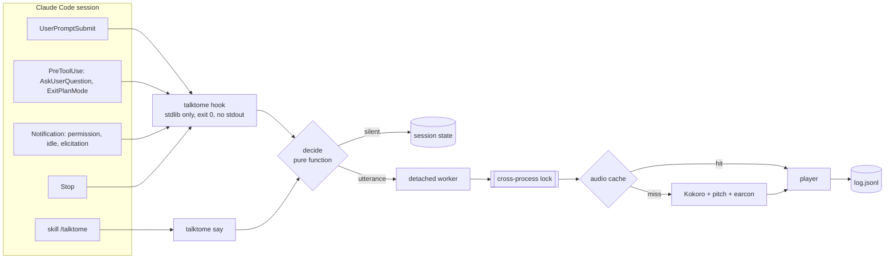

# DESIGN — TalkToMe v0

**Author:** Olivier Vitrac, PhD, HDR — Adservio Innovation Lab — Adservio Group — olivier.vitrac@adservio.fr
**Status:** validated 2026-10-06 (milestones M1–M2 authorized) · **Date:** 2026-10-06
**Decisions:** `base/DECISIONS.md` — D-0003 (hooks + skill, plugin), D-0005 (wording), D-0006 (session naming),
D-0007 (event mapping, §3), D-0008 (registers and moods, §4–§5), all closed

---

## 1. Goal

A Claude Code session calls its user by voice when it needs them or has finished a long turn, and says which
session is speaking. Local speech (Kokoro-82M through `kokoro-onnx`), English by default, French available, two
registers (*useful*, *fun*), moods, voice and wording tunable. The hooks never slow down or alter a session.

## 2. Architecture



- **Hook fast path.** `talktome hook` reads the hook JSON on stdin, updates the session state, calls
  `decide()`, and if there is something to say spawns the worker in a new process session
  (`start_new_session=True`, stdio to `/dev/null`), then returns. It imports only the standard library, prints
  nothing on stdout, and exits 0 on every path, malformed input included: exit 2 or JSON on stdout would change
  Claude's behaviour on `PreToolUse`.
- **Worker.** Takes the lock (`fcntl.flock`, one file for all sessions), so utterances queue instead of
  overlapping. It renders the audio or reads it from the cache, plays it, writes one log line, and releases the
  lock.
- **Latency budget (measured parts in parentheses).** Hook < 100 ms. Cache hit: about 0.3 s to sound. Cache
  miss: imports + model load (0.74 s) + synthesis (≈ 1.0 s per sentence) ≈ 2–2.5 s. The *useful* templates are
  fixed and session names repeat, so most alerts are cache hits.
- **Engines.** Kokoro by default; `spd-say` as fallback when Kokoro or its models are unavailable; nothing
  else in v0.

## 3. Events and mapping (D-0007, proposed)

| Class | Hook event | Matcher / condition | Spoken when |
|---|---|---|---|
| — | `UserPromptSubmit` | — | never; records the turn start |
| `help` | `PreToolUse` | `AskUserQuestion`, `ExitPlanMode` | always (Claude is blocked) |
| `help` | `Notification` | `elicitation_dialog` | always (Claude is blocked) |
| `attention` | `Notification` | `permission_prompt` | always (Claude is blocked) |
| `input` | `Notification` | `idle_prompt` | only if the session said nothing during the last `input_cooldown_s` |
| `landed` | `Stop` | `stop_hook_active` false | only if the turn lasted ≥ `landed_min_turn_s` = **60 s** (ruled) |

Noise rules (defaults, all tunable):

| Parameter | Default | Effect |
|---|---|---|
| `landed_min_turn_s` | 60 | quiet threshold for *landed* (ruled 2026-10-06) |
| `debounce_s` | 15 | a second alert from the same session within 15 s is dropped (question + notification) |
| `input_cooldown_s` | 300 | *input* is a reminder: silent if the session spoke within 5 min (no "landed" then "waiting") |
| `say_suppresses_landed_s` | 120 | a deliberate `say` replaces the *landed* alert of the same turn |
| `mute`, `mute_until` | false, null | no speech (indefinitely, or until an epoch time); decisions still logged |

A turn with no recorded start (resumed session) never produces *landed*.

## 4. Wording (D-0005 closed; catalogue proposed with D-0008)

Templates take `{name}` (the addressee, from the configuration; empty by default) and `{session}`. When `{name}`
is empty, the renderer removes it together with its comma or space ("Psst, {name}." → "Psst."). A catalogue
test checks that every template renders cleanly both ways. The catalogue ships with the package. The user can
replace or extend any entry in the configuration.

### 4.1 *useful*: one sober sentence per class

| Class | English | French |
|---|---|---|
| `help` | {name}, {session} needs your help. | {name}, {session} a besoin de ton aide. |
| `attention` | {name}, {session} needs your attention. | {name}, {session} a besoin de ton attention. |
| `input` | {name}, {session} needs your input. | {name}, {session} attend ta réponse. |
| `landed` | {name}, the results of {session} landed. | {name}, les résultats de {session} sont déposés. |

### 4.2 *fun*: rotating variations, written by Claude

Picked at random without repeating the previous one for the same session and class.

**help**

| English | French |
|---|---|
| Psst, {name}. {session} has a question only you can answer. | Psst, {name} ! {session} a une question pour toi. |
| {name}, {session} is standing at a fork in the road. Your call. | {name}, {session} hésite à la croisée des chemins. À toi de trancher. |
| {session} raises a hand, {name}. Help wanted. | {session} lève la main, {name}. On a besoin de toi. |
| {name}, {session} would like a human opinion before going further. | {name}, {session} aimerait ton avis avant d'aller plus loin. |
| Quick one, {name}: {session} needs you to decide. | Une petite décision, {name} : {session} compte sur toi. |

**attention**

| English | French |
|---|---|
| Knock knock, {name}. {session} needs your green light. | Toc toc, {name} ! {session} attend ton feu vert. |
| {name}, {session} is waiting at the door for your approval. | {name}, {session} patiente à la porte. Tu autorises ? |
| Excuse me, {name}: {session} needs your signature. | Pardon de te déranger, {name} : {session} a besoin de ta signature. |
| {session} is holding its breath, {name}. Permission, please? | {session} retient son souffle, {name}. Une autorisation, s'il te plaît ? |
| {name}, one click from you and {session} is back on its way. | {name}, un clic de ta part et {session} repart. |

**input**

| English | French |
|---|---|
| Your move, {name}. {session} is waiting. | À toi de jouer, {name}. {session} t'attend. |
| {session} is all ears, {name}. | {session} est tout ouïe, {name}. |
| {name}, {session} has said its piece. Over to you. | {name}, {session} a fini. La parole est à toi. |
| Whenever you're ready, {name}, {session} is listening. | Quand tu veux, {name}, {session} t'écoute. |
| {session} is twiddling its thumbs, {name}. | {session} se tourne les pouces, {name}. |

**landed**

| English | French |
|---|---|
| Ta-da! {session} has delivered, {name}. | Et voilà ! {session} a livré, {name}. |
| {name}, fresh results from {session}, still warm. | {name}, les résultats de {session} sont servis, encore chauds. |
| Mission complete for {session}. Come and see, {name}. | Mission accomplie pour {session}. Viens voir, {name} ! |
| {session} has landed its work on your desk, {name}. | {session} a déposé son travail sur ton bureau, {name}. |
| Good news, {name}: {session} is done. | Bonne nouvelle, {name} : {session} a terminé. |

### 4.3 Session name (D-0006 closed)

`{session}` = the name given to the session, else the working-directory basename. A name can be given at launch
(`TALKTOME_SESSION="Data cleaning" claude`) or from inside the session (`talktome name "Data cleaning"`, keyed on
`CLAUDE_CODE_SESSION_ID`, which Claude Code exports to the commands it runs). A respelling map in the
configuration fixes pronunciation before phonemization (`ETL2` → `E T L 2`).

## 5. Moods and registers (D-0008, proposed)

Kokoro has no emotion control. A measured `!` leaves pitch and duration unchanged. A mood is therefore a preset
of the levers that do act:

| Mood | Speed | Pitch (st) | Earcon (synthesized, ≈ 0.4 s) |
|---|---|---|---|
| `neutral` | 1.00 | 0 | one soft tone |
| `warm` | 0.95 | 0 | rising major third |
| `calm` | 0.90 | −1 | low major-seventh pad |
| `cheerful` | 1.05 | +1 | ascending major arpeggio |
| `firm` | 1.05 | 0 | two repeated notes |
| `urgent` | 1.12 | +1 | three quick notes |
| `sorry` | 0.90 | −2 | descending minor third |

- **Default mood per class:** `help` → warm, `attention` → firm, `input` → calm, `landed` → cheerful.
  Claude may choose another mood for a deliberate message (e.g. `sorry` when a long run failed). The user may
  remap the defaults.
- **Pitch without changing speed.** To shift by $p$ semitones, synthesize at speed $s/f$ with $f = 2^{p/12}$,
  then resample by $f$ (`numpy.interp`). Duration comes back to speed $s$ and pitch moves by $p$. No new
  dependency. The formant shift is acceptable within ±2 st.
- **Earcons** are synthesized with numpy (additive tones and envelopes) and cached; no audio files ship.

| | *useful* | *fun* |
|---|---|---|
| Wording | §4.1, one fixed sentence | §4.2, rotating variations |
| Mood levers | speed and earcon only (pitch 0) | full preset |
| Voice | the configured voice per language | one voice per session, picked from a pool by a stable hash of the session name (EN); in French, the single voice `ff_siwis` with a per-session pitch offset in {−2…+2} st |

### 5.1 Gender of a session (D-0013, D-0014)

Sessions are people, not objects: "he" or "she", never "it" (the lead: *"I prefer to interact with a his/her
than with an it = cold object = dead"*). The gender of a session comes, in order, from: the gender set for the
session (`talktome name … --gender`, `talktome gender f|m`), the user's `genders` map, then an improvised guess
from the spoken name (`gender.py`), as a native speaker would make it:

| Cue | Example | Gender |
|---|---|---|
| leading French article | *la chaise*, *une table* / *le moteur*, *un pipeline* | f / m |
| known given or mythological name | Ariadne, Rosetta, Agnès / Hermes, Étienne | f / m |
| French noun ending | *-tion*, *-sion*, *-aison* / *-age*, *-isme*, *-ème* | f / m |
| final letter | *-a*, *-e* / *-o*, *-u*, consonant | f / m |
| none (acronym, *-i*, *-y*, digits) | ETL2, API, Origami | stable hash |

The improvisation is deterministic: a name keeps the gender it was first given. The gender selects the English
voice in both registers (`voices.en.f` / `voices.en.m` in *useful*; the pool voices of that gender in *fun*,
told apart by the second letter of the Kokoro name: `bf_`, `af_` / `bm_`, `am_`) and fills `{his}` (*his* /
*her*). French keeps its single voice `ff_siwis` for every session (D-0014); its templates use no gendered
agreement on the session.

### 5.2 Per-session modes (D-0016)

| Mode | Behaviour |
|---|---|
| `on` | default |
| `discreet` | the session is spoken as "a session" / "une session", with the gender and voice of that phrase (nothing that identifies it); free text (`say`) refused; canned messages (joke, fact, why) allowed |
| `off` | silent, the turn bookkeeping still runs |

Precedence: set in the session (`talktome mode`, state keyed on `CLAUDE_CODE_SESSION_ID`) → `TALKTOME` at launch →
the first matching folder rule of `private` (`fnmatch` on the working directory and its parents, `~` expanded) →
`on`. `private` is empty by default (the lead: *"discreet mode actionable but not by default"*). `talktome test`
plays even in an `off` session and applies `discreet`.

## 6. Configuration

One file, `~/.config/talktome/config.json` (schema `talktome-config/1`), written by `talktome setup` and
`talktome set`, editable by hand:

```json
{
  "schema": "talktome-config/1",
  "name": "",
  "language": "en",
  "register": "useful",
  "voices": { "en": { "f": "bf_emma", "m": "bm_george" }, "fr": { "f": "ff_siwis", "m": "ff_siwis" } },
  "speed": { "en": 1.0, "fr": 1.0 },
  "volume": 1.0,
  "earcons": true,
  "mute": false,
  "mute_until": null,
  "models_dir": "",
  "player": "auto",
  "thresholds": { "landed_min_turn_s": 60, "debounce_s": 15, "input_cooldown_s": 300, "say_suppresses_landed_s": 120 },
  "moods": { "help": "warm", "attention": "firm", "input": "calm", "landed": "cheerful" },
  "fun": { "voice_pool": ["bm_george", "bf_emma", "am_michael", "af_heart", "bm_lewis", "bf_isabella"], "voice_per_session": true },
  "templates": {},
  "respell": {},
  "genders": {},
  "private": {}
}
```

`speed` is one number for both languages or one per language (`talktome set speed.en 1.2`); moods multiply
it. State lives in `~/.local/state/talktome/` (per-session turn start, last spoken time, given name, rotation index;
the lock; `log.jsonl`) and audio in `~/.cache/talktome/`.

## 7. Command line

| Command | Use |
|---|---|
| `talktome hook` | hook entry point (stdin JSON; silent; exit 0) |
| `talktome say [--mood M] [--class C] TEXT` | deliberate message (skill or user) |
| `talktome name TEXT [--gender f\|m]` | name the current session (gender improvised if omitted) |
| `talktome gender [f\|m\|auto]` | show or set the current session's gender |
| `talktome mode [on\|discreet\|off\|auto]` | show or set the current session's mode (§5.2) |
| `talktome joke` / `talktome fact` / `talktome why [N]` | a joke, a surprising fact, an answer to "why?" (§7.1) |
| `talktome set KEY VALUE` / `talktome show` | settings (`set language fr`, `set register fun`, `set voices.en bf_emma`, `set name Olivier`) |
| `talktome voices [--lang en\|fr]` | list voices |
| `talktome mute [MINUTES]` / `talktome unmute` | silence |
| `talktome test [--class C] [--mood M]` | speak a sample, on request only |
| `talktome doctor` | models (SHA-256), player, config, `PATH` link, last log lines |
| `talktome setup [--models-dir DIR \| --fetch]` | first configuration, link in `~/.local/bin`, models |

### 7.1 Jokes, facts and why (D-0017)

Canned deliberate messages, printed then spoken, in the configured language (`fun.toml`). Jokes and facts are
dealt from a shuffled deck kept in the state directory: none repeats before all have been told. Written to be
heard (no digits or symbols to read aloud); facts are well-established ones only. `why` answers like MATLAB's
`why`: a special case one time in five, else a grammatical sentence from word lists (own lists; French agreement
and elision); `why N` is reproducible.

## 8. Plugin and skill

```text
plugin/
├── .claude-plugin/plugin.json
├── hooks/hooks.json                   # UserPromptSubmit, PreToolUse, Notification, Stop → "talktome hook"
└── skills/talktome/SKILL.md           # /talktome
```

- **Hooks.** Every entry runs `hooks/talktome-hook.sh`, which passes stdin to `talktome hook` (found on `PATH`
  or in `~/.local/bin`), prints nothing and always exits 0. If TalkToMe is not installed, the session is
  unaffected. The plugin adds hooks next to the existing ones and never edits
  `settings.json` itself.
- **Skill.** User-invocable as `/talktome …` (`/talktome fr`, `/talktome fun`, `/talktome voice bf_emma`,
  `/talktome mute 30`, `/talktome name "Data cleaning"`). Claude may also invoke it in two cases: when the user
  asked to be told by voice, or at the end of a long autonomous task whose outcome the user should hear (a
  failure especially). A message is one or two short natural sentences in the configured language with a chosen
  mood. It never contains a secret, a `TAG-xxxx` placeholder, a path, code, or quoted content.
- **Install (two steps).**
  1. Python package: `pipx install git+https://github.com/ovitrac/TalkToMe`, or `pip install -e .` in an env,
     then `talktome setup`.
  2. Plugin, from the **adservio** marketplace (D-0015): `/plugin marketplace add ovitrac/AdservioToolbox`, then
     `/plugin install talktome@adservio` (alone) or `adservio-toolbox@adservio` (with the other Adservio tools).

## 9. Repository layout

```text
TalkToMe/
├── pyproject.toml                      # deps: kokoro-onnx, soundfile, numpy; dev: pytest, mypy, black, isort, flake8
├── src/talktome/
│   ├── cli.py        # argument parsing; light imports only
│   ├── hook.py       # fast path: stdin → state → decide → detach
│   ├── decide.py     # pure: event + state + config + clock → Utterance | None
│   ├── catalog.py    # loads catalog.toml, renders templates, empty-name rule
│   ├── catalog.toml  # §4, both registers, EN / FR
│   ├── moods.py      # §5 presets
│   ├── config.py     # schema, defaults, validation, set/show
│   ├── state.py      # per-session state files
│   ├── worker.py     # lock → cache → render → play → log
│   ├── engine.py     # Kokoro (model check, voices, blend, pitch), spd-say fallback
│   ├── earcon.py     # numpy chimes
│   └── player.py     # pw-play → paplay → aplay → ffplay → mpv
├── plugin/ …                            # listed in the adservio marketplace (ovitrac/AdservioToolbox)
├── tests/
└── base/
```

## 10. Tests and falsifiers

| ID | Claim | Falsified if |
|---|---|---|
| T1 | `decide()` follows §3 for every event × condition (59 s vs 60 s, `stop_hook_active`, debounce, cooldown, `say` suppression, mute) | any table row gives another outcome |
| T2 | the catalogue is complete and clean | a (register, language, class) is empty, a placeholder is unknown, a *useful* entry has two sentences, or a render with an empty name leaves `, .`, a leading comma, or a double space |
| T3 | the hook never interferes | stdout non-empty, exit ≠ 0 on malformed or empty stdin, missing config or missing models, or median wall time ≥ 100 ms over 50 runs |
| T4 | speech is serialized | two concurrent workers with a fake player produce overlapping play intervals |
| T5 | the cache is keyed correctly | changing text, voice, speed, pitch, language or model does not change the key, or a repeat misses |
| T6 (live, `TALKTOME_LIVE=1`) | Kokoro renders EN and FR; the pitch shift preserves duration within 5 % | either fails |

## 11. Milestones

| | Content | Audible |
|---|---|---|
| M1 | config, catalogue, `decide()`, renderer; T1, T2 | no |
| M2 | engine, pitch, earcons, cache, lock, player, log; `say`, `test`, `doctor`, `setup`; T4–T6 | on request |
| M3 | hook fast path + plugin hooks; T3; the lead installs the plugin | yes |
| M4 | skill and settings commands | yes |
| M5 | README (usage, install, model fetch), tag `v0.1.0` | — |
